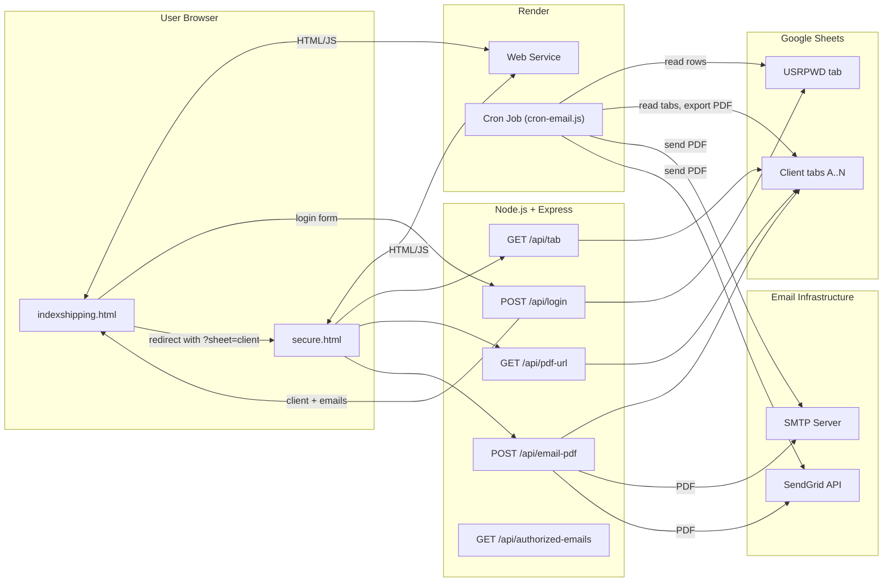
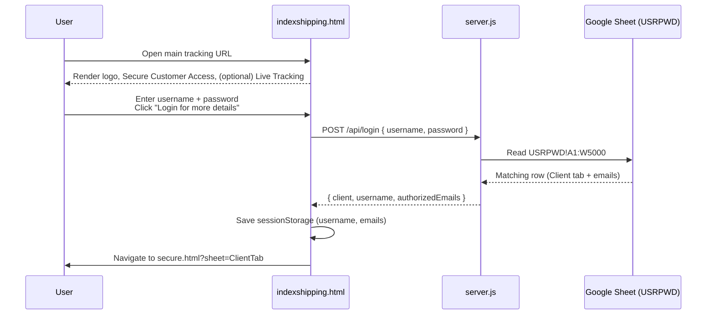
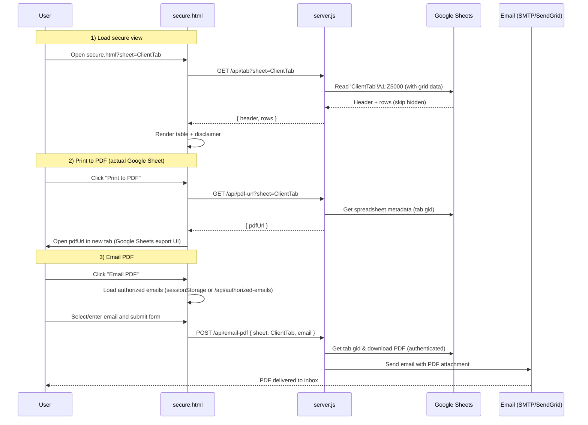
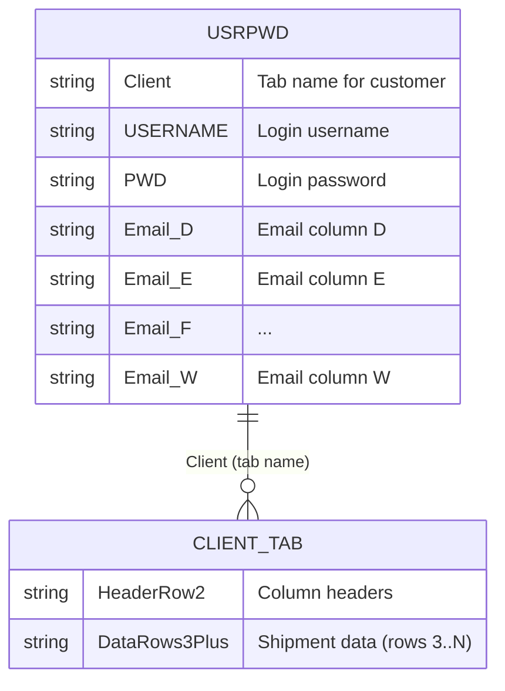

# Shesha Logistics Shipment Tracking System
## Customer Overview & User Guide

---

## Welcome

This document provides an overview of your **Shesha Logistics Shipment Tracking System** – a secure, web-based platform that gives your customers real-time access to their shipment information and automated daily reports.

---

## What This System Does

Your tracking system provides two main services:

### 1. **Secure Customer Portal**
- Customers log in with their unique username and password
- They can view their shipment data in a clean, easy-to-read table format
- Data is pulled directly from your Google Sheets, so it's always up-to-date
- Customers can print or email their reports as PDFs

### 2. **Automated Daily Reports**
- The system now runs **two weekday cron schedules**:
  - **Main run (all customers):** 8:30 AM Johannesburg time
  - **TNL follow-up run (TNL only):** 4:00 PM Johannesburg time
- In each run, the system:
  - Generates a PDF report for qualifying customers
  - Emails it to all authorized email addresses for that customer
  - Only sends reports when there's actual shipment data to report

---

## System Overview

**How the system works:**



---

## Key Features

### ✅ **Secure Access**
- Each customer has their own login credentials
- They can only see their own shipment data
- No customer can access another customer's information

### ✅ **Real-Time Data**
- Information is pulled directly from your Google Sheets
- Updates in Google Sheets appear immediately in the customer portal
- No manual data entry needed

### ✅ **Easy to Use**
- Simple login page with username and password
- Clean, professional interface matching your Shesha Logistics branding
- Responsive design that works on desktop, tablet, and mobile devices

### ✅ **Print & Email Options**
- Customers can print their reports directly from the browser
- They can email PDF reports to themselves or colleagues
- Authorized email addresses are pre-loaded for convenience

### ✅ **Automated Reporting**
- Daily PDF reports sent automatically every weekday
- Reports only sent when there's actual shipment data
- Up to 20 email addresses per customer can receive reports

### ✅ **Professional Presentation**
- Reports include a disclaimer about estimated arrival times
- Clean, formatted tables that are easy to read
- Professional branding throughout

---

## How Customers Use the System

### Step 1: Access the Portal
Customers visit your tracking website and see the login page with:
- Your Shesha Logistics logo
- A simple login form asking for username and password

### Step 2: Login Process



### Step 3: View Shipment Data
Once logged in, customers see:
- A wide table showing all their shipment information
- Column headers from row 2 of their Google Sheet tab
- All data rows (hidden rows are automatically skipped)
- Text wrapping for long entries so nothing is cut off

### Step 4: Print or Email Reports

**Printing:**
- Click "Print to PDF" button
- Opens the actual Google Sheet in PDF format (landscape mode)
- Customer can save or print from their browser

**Emailing:**
- Click "Email PDF" button
- A popup appears with:
  - Dropdown list of authorized email addresses (if configured)
  - Option to enter any other email address manually
- System generates PDF and emails it immediately



---

## Google Sheets Setup

Your system uses Google Sheets as the data source. Here's how it's organized:

### **USRPWD Tab** (User Management)
This tab manages all customer logins and email addresses:

- **Column A**: Client name (must match the tab name for that customer)
- **Column B**: Username (what customers use to log in)
- **Column C**: Password
- **Columns D-W**: Up to 20 email addresses that can receive automated daily reports

### **Client Tabs** (One per Customer)
Each customer has their own tab in the spreadsheet:

- **Row 1**: Reserved for titles or notes (not displayed)
- **Row 2**: Column headers (these appear as table headers in the customer portal)
- **Row 3 onwards**: Actual shipment data (displayed in the customer portal)

**Important Notes:**
- Hidden rows in Google Sheets are automatically skipped
- Only tabs with data from row 3 onwards will trigger automated email reports
- Data updates in Google Sheets appear immediately in the customer portal



---

## Automated Daily Reports

### How It Works

The automation now works in two weekday schedules:

1. **Main customer run** at **8:30 AM Johannesburg** (`30 6 * * 1-5`)
   - Reads the USRPWD tab to get all customers
   - Processes all customer tabs with valid recipients and data

2. **TNL-only follow-up run** at **4:00 PM Johannesburg** (`0 14 * * 1-5`)
   - Uses the same report pipeline
   - Filters processing to `TNL` only

In each run, the system:

1. **Reads the USRPWD tab** to get the applicable customer rows
2. **For each applicable customer:**
   - Checks if their tab has shipment data (from row 3 onwards)
   - If data exists, generates a PDF of their entire tab
   - Emails the PDF to all addresses listed in columns D-W for that customer
   - Waits 5 seconds before processing the next customer (to avoid rate limits)

3. **Skips customers** who:
   - Don't have a client tab name configured
   - Don't have any email addresses listed
   - Don't have any data in their tab (empty tabs don't get reports)

### Email Content

The automated emails include:
- Subject: Daily tracking report
- Body: Professional message from "The Shesha Team"
- Attachment: PDF report of the customer's shipment data

**Email Text:**
> Please find your daily tracking report for your active shipments attached.
> 
> For real-time updates throughout the day, you can access live tracking by logging into our website at www.sheshalogistics.com.
> 
> Wishing you a pleasant day.
> 
> The Shesha Team

### Schedule

- **Main run (all customers)**: `30 6 * * 1-5` = 8:30 AM Johannesburg, Monday-Friday
- **TNL-only run**: `0 14 * * 1-5` = 4:00 PM Johannesburg, Monday-Friday
- **No emails on weekends**: Saturday and Sunday are skipped for both jobs

```mermaid
flowchart TD
  Start[Start cron-email.js] --> CheckEnv[Validate env vars & service-account-key.json]
  CheckEnv --> GetSheets[Connect to Google Sheets]
  GetSheets --> ReadUSRPWD[Read USRPWD!A1:W5000]
  ReadUSRPWD --> ForEachRow{For each data row<br/>(row >= 2)}

  ForEachRow -->|No Client / no emails| SkipRow[Skip row (log reason)]
  SkipRow --> NextRow[Next row]

  ForEachRow -->|Has Client + emails| CheckData[Check client tab has data from row 3+]
  CheckData -->|No data| SkipNoData[Skip (no data rows)]
  SkipNoData --> NextRow

  CheckData -->|Has data| GetGid[Find tab gid]
  GetGid --> DownloadPDF[Download PDF for tab (authenticated)]
  DownloadPDF --> SendEmail[Send email with PDF to all row emails]
  SendEmail --> Delay[Wait 5 seconds]
  Delay --> NextRow

  NextRow -->|More rows| ForEachRow
  NextRow -->|No more rows| End[Finish job, log summary]
```

---

## Security & Privacy

### **Data Protection**
- Customer data is stored securely in Google Sheets
- Access is controlled through username/password authentication
- Each customer can only see their own data
- Service account authentication ensures secure API access

### **Email Security**
- Email sending uses industry-standard SMTP or SendGrid
- PDFs are generated securely using Google's authenticated APIs
- No customer data is stored on the web server

### **Best Practices**
- Passwords are stored in Google Sheets (consider upgrading to hashed passwords for enhanced security)
- Service account keys are never committed to code repositories
- All API communications use secure HTTPS connections

---

## System Requirements

### **For You (System Administrator)**
- Google Cloud account with:
  - Google Sheets API enabled
  - Google Drive API enabled
  - Service account created and configured
- Google Sheet shared with the service account email
- Render.com account (for hosting)
- Email service (Gmail SMTP or SendGrid)

### **For Your Customers**
- Any modern web browser (Chrome, Firefox, Safari, Edge)
- Internet connection
- Username and password (provided by you)

---

## Support & Maintenance

### **What You Need to Maintain**

1. **Google Sheet Updates**
   - Keep customer data updated in Google Sheets
   - Add new customers by creating new tabs and adding rows to USRPWD
   - Update email addresses in columns D-W as needed

2. **User Management**
   - Add new customers: Create tab + add row to USRPWD
   - Change passwords: Update column C in USRPWD tab
   - Update email lists: Modify columns D-W in USRPWD tab

3. **Monitoring**
   - Check Render logs to ensure automated emails are sending
   - Verify Google Sheet access permissions
   - Monitor email delivery (check spam folders if reports aren't received)

### **Troubleshooting**

**Customers can't log in:**
- Verify username and password in USRPWD tab (columns B and C)
- Ensure the Client column (A) matches the tab name exactly
- Check that the tab exists in the spreadsheet

**Automated emails not sending:**
- Check Render cron job logs
- Verify email addresses are valid (columns D-W)
- Ensure customer tabs have data from row 3 onwards
- Confirm email service (SMTP/SendGrid) is configured correctly

**Diagrams not displaying:**
- Ensure internet connection (diagrams load from external services)
- Check browser console for errors
- Try refreshing the page

---

## Benefits Summary

### **For Your Business**
✅ **Professional Image**: Modern, branded customer portal  
✅ **Time Savings**: Automated daily reports eliminate manual work  
✅ **Scalability**: Easy to add new customers (just add a tab)  
✅ **Data Accuracy**: Direct connection to Google Sheets ensures real-time data  
✅ **Customer Satisfaction**: 24/7 access to shipment information  

### **For Your Customers**
✅ **Convenience**: Access shipment data anytime, anywhere  
✅ **Transparency**: Real-time updates on their shipments  
✅ **Professional Reports**: Clean PDF reports for their records  
✅ **Easy Sharing**: Email reports to colleagues or partners  
✅ **Mobile Friendly**: Works on phones, tablets, and computers  

---

## Technical Architecture (Simplified)

The system consists of:

1. **Frontend**: Web pages that customers see (login page and data view)
2. **Backend**: Server that handles logins, data retrieval, and email sending
3. **Data Source**: Your Google Sheets spreadsheet
4. **Hosting**: Render.com (web service + automated cron job)
5. **Email Service**: SMTP (Gmail) or SendGrid for sending reports

```mermaid
flowchart TD
  A[Create Google Cloud project] --> B[Enable Google Sheets API]
  A --> C[Enable Google Drive API]
  B --> D[Create Service Account]
  C --> D
  D --> E[Generate JSON key file]
  E --> F[Save as service-account-key.json locally]
  E --> G[Copy raw JSON into SERVICE_ACCOUNT_JSON on Render]
  D --> H[Get service account email]
  H --> I[Share Google Sheet with service account (Viewer/Editor)]
  I --> J[Backend & cron job can read sheet + export PDFs]
```

---

## Contact & Support

For technical support or questions about the system, please refer to:
- **Technical Documentation**: `PROJECT_DOCUMENTATION.md`
- **Deployment Guide**: `RENDER_DEPLOY.md`
- **Cron Job Setup**: `RENDER_CRON_SETUP.md`
- **Troubleshooting**: `CRON_TROUBLESHOOTING.md`

---

## Disclaimer

All Estimated Times of Arrival (ETAs) are estimates only and subject to change without notice. We are not liable for delays caused by carriers, ports, customs or other factors beyond our control.

---

*Document Version: 1.0*  
*Last Updated: 2025*
