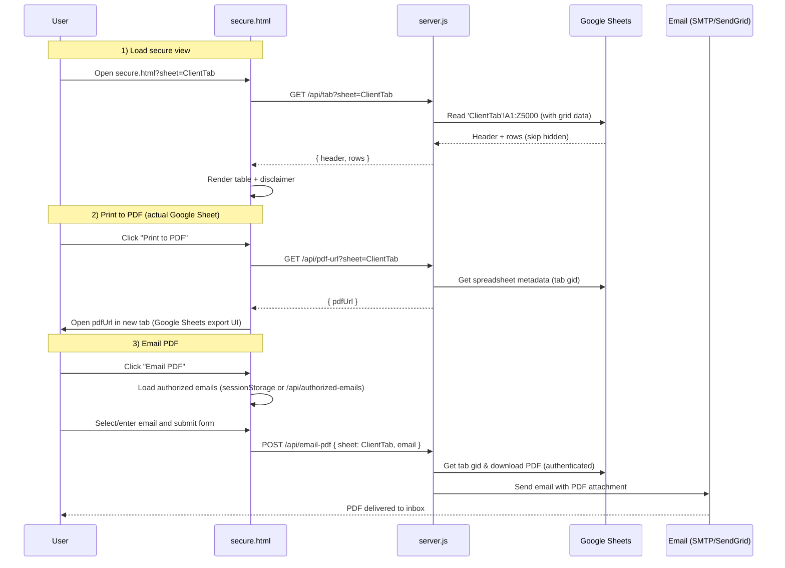
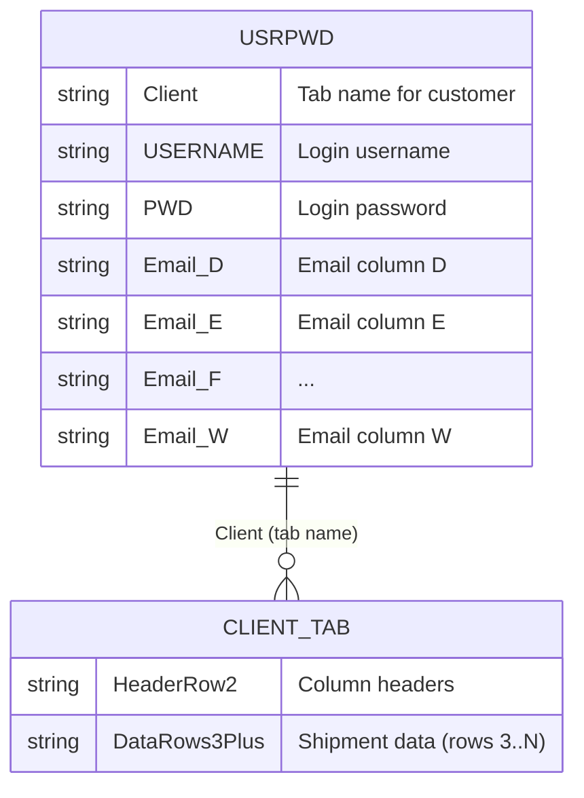

## Shesha Logistics / Redfiniti Tracking – Project Documentation

This document describes the complete architecture and operational details of your container tracking application: frontend, backend, Google Sheets / Google APIs integration, deployment on Render, and the scheduled cron jobs for automated PDF emails.

---

## 1. High‑Level Architecture

- **Frontend (static HTML + Tailwind via CDN)**
  - `indexshipping.html`: Public entry page with:
    - Branding (logo + title “Shesha Logistics Shipment Tracking”).
    - **Secure Customer Access** login form.
    - (Optionally hidden) “Today’s Live Tracking” section with static/dummy data and external shipping line links.
  - `secure.html`: Secure view of a specific customer’s Google Sheet tab (read‑only, wide table, horizontal scroll, print/email buttons).

- **Backend (Node.js + Express – `server.js`)**
  - Serves static files (`indexshipping.html`, `secure.html`, assets).
  - REST API endpoints:
    - `POST /api/login` – authenticates against the `USRPWD` tab in Google Sheets.
    - `GET /api/tab?sheet=<TabName>` – returns tab data (header + rows) for secure display.
    - `GET /api/pdf-url?sheet=<TabName>` – returns a Google Sheets PDF export URL for the given tab.
    - `POST /api/email-pdf` – generates and emails a PDF of the tab to a chosen email address.
    - `GET /api/authorized-emails?username=<username>` – returns authorized email addresses for a given user from `USRPWD`.
  - Uses **Google Sheets API** and **Google Drive export endpoint** via a **service account**.
  - Uses **Nodemailer** for SMTP or **SendGrid** for email delivery.

- **Data Source (Google Sheets)**
  - One master spreadsheet (`SHEET_ID` from `.env`):
    - `USRPWD` tab: user login + authorized email addresses + client tab names.
    - One tab per customer (client), each containing shipment/tracking data.

- **Deployment (Render)**
  - **Web Service**: runs `server.js` and serves the app.
  - **Cron Jobs**:
    - `daily-email-reports-06h30`: runs `cron-email.js` on weekdays for all customers.
    - `daily-email-reports-tnl-16h00`: runs `cron-email-tnl.js` on weekdays for `TNL` only.

**High‑level system diagram (logical view)**

```mermaid
flowchart LR
  subgraph UserBrowser["User Browser"]
    MainPage["indexshipping.html"]
    SecureView["secure.html"]
  end

  subgraph Backend["Node.js + Express"]
    APILogin["POST /api/login"]
    APITab["GET /api/tab"]
    APIPdfUrl["GET /api/pdf-url"]
    APIEmailPdf["POST /api/email-pdf"]
    APIAuthEmails["GET /api/authorized-emails"]
  end

  subgraph GSheet["Google Sheets"]
    USRPWD["USRPWD tab"]
    ClientTabs["Client tabs A..N"]
  end

  subgraph EmailInfra["Email Infrastructure"]
    SMTP["SMTP Server"]
    SendGrid["SendGrid API"]
  end

  subgraph Render["Render"]
    WebService["Web Service"]
    CronJob["Cron Job (cron-email.js)"]
  end

  MainPage <-- "HTML/JS" --> WebService
  SecureView <-- "HTML/JS" --> WebService

  MainPage -->|login form| APILogin
  APILogin --> USRPWD
  APILogin -->|client + emails| MainPage
  MainPage -->|"redirect with ?sheet=client"| SecureView

  SecureView --> APITab
  APITab --> ClientTabs

  SecureView --> APIPdfUrl
  APIPdfUrl --> ClientTabs

  SecureView --> APIEmailPdf
  APIEmailPdf --> ClientTabs
  APIEmailPdf -->|PDF| SMTP
  APIEmailPdf -->|PDF| SendGrid

  CronJob -->|read rows| USRPWD
  CronJob -->|"read tabs, export PDF"| ClientTabs
  CronJob -->|send PDF| SMTP
  CronJob -->|send PDF| SendGrid```

---

## 2. Frontend Details

### 2.1 `indexshipping.html` – Main Tracking Page

- **Technologies**
  - Pure HTML5.
  - Tailwind CSS via CDN for styling.
  - Vanilla JavaScript for handling form submissions and navigation.

- **Key Sections**
  - **Header / Branding**
    - Shesha logo (`shesha logo.avif`) and title “Shesha Logistics Shipment Tracking”.
  - **Secure Customer Access** (centered, main functional section)
    - Inputs:
      - `Username` – maps to `USERNAME` column in `USRPWD`.
      - `Password` – maps to `PWD` column in `USRPWD`.
    - Buttons:
      - **Login for more details**:
        - Calls `POST /api/login` with `{ username, password }`.
        - On success:
          - Receives `{ client, username, authorizedEmails }`.
          - Stores:
            - `sessionStorage.loggedInUsername = username`.
            - `sessionStorage.authorizedEmails = JSON.stringify(authorizedEmails)`.
          - Navigates (same tab) to: `secure.html?sheet=<clientTabName>`.
      - **Back to main page**:
        - Opens `https://www.sheshalogistics.com/` in the same window.
  - **Today’s Live Tracking** (can be hidden)
    - Shipping line dropdown:
      - `MACS` → opens `https://www.macship.com/SCHEDULES` in a new tab.
      - `MSC` → opens `https://www.msc.com/en/track-a-shipment` in a new tab.
      - `Bobs shipping` → reserved/demo.
    - Container number input (for demo only; backend is intentionally **not** linked here).
    - “Go Fetch” shows static dummy tracking data:
      - Container Number, Shipped From, Port of Load, Port of Discharge, Shipped To, Transhipment, Price Calculation Date.
      - Disclaimer in this section: “* All information above is dummy data for demonstration purposes only.”
    - Section can be hidden via CSS class (`hidden`) per your latest requirements.

**Page‑level interaction (main page)**

```mermaid
sequenceDiagram
  participant U as User
  participant I as indexshipping.html
  participant S as server.js
  participant G as Google Sheet (USRPWD)

  U->>I: Open main tracking URL
  I-->>U: Render logo, Secure Customer Access, (optional) Live Tracking

  U->>I: Enter username + password<br/>Click "Login for more details"
  I->>S: POST /api/login { username, password }
  S->>G: Read USRPWD!A1:W5000
  G-->>S: Matching row (Client tab + emails)
  S-->>I: { client, username, authorizedEmails }

  I->>I: Save sessionStorage (username, emails)
  I->>U: Navigate to secure.html?sheet=ClientTab
```

### 2.2 `secure.html` – Secure Customer View

- **Purpose**
  - Shows a **read‑only** view of a single Google Sheet tab (client tab) selected via the login process.
  - Designed to be **wide** with horizontal scrolling and wrapped text in cells.

- **How it gets the data**
  - Reads `sheet` from query string: `secure.html?sheet=<TabName>`.
  - Calls `GET /api/tab?sheet=<TabName>`.
  - Renders:
    - Row 2 of the sheet as the **header** row.
    - Data from row 3 onward as the **body** (skipping hidden rows).

- **Layout & Styling**
  - Tailwind CSS via CDN.
  - Sticky table header, alternating row colors, text wrapping in cells, and responsive container with maximum height (`max-h-[75vh]`) for scrolling.
  - Final column wrapping: `<td>` cells allow `white-space: normal` and `word-wrap: break-word`, so long texts are fully visible.

- **Actions in Header**
  - **Print to PDF**:
    - Button `Print to PDF` calls `GET /api/pdf-url?sheet=<TabName>`.
    - Backend resolves the tab’s `gid` and returns a **Google Sheets PDF export URL** (landscape mode).
    - Frontend opens this URL in a new tab → user uses browser/Sheets UI to save the PDF.
  - **Email PDF**:
    - Opens a modal with:
      - Dropdown of **authorized emails** (from `USRPWD` columns D–W, via `sessionStorage` or `GET /api/authorized-emails`).
      - Manual input for other email addresses.
    - Submits to `POST /api/email-pdf` with `{ sheet, email }`.
  - **Logout to main page**:
    - Navigates back to `indexshipping.html` in the same tab.

- **Disclaimer below the table**
  - Displayed when data loads successfully and also printed in PDF:
    - “All Estimated Times of Arrival (ETAS) are estimates only and subject to change without notice. We are not liable for delays caused by carriers, ports, customs or other factors beyond our control.”

**Data load, print and email flows (secure view)**



---

## 3. Backend Details (`server.js`)

### 3.1 Technology & Structure

- **Node.js** (ESM: `"type": "module"` in `package.json`).
- **Express.js** for HTTP server and routing.
- **googleapis** library for Google authentication and Sheets access.
- **Nodemailer** for email sending, with optional **SendGrid** support.
- **dotenv** for loading `.env` locally.
- `__dirname`/`__filename` polyfill for ES modules.

### 3.2 Environment Variables

Typically configured via `.env` (locally) and Render’s **Environment** settings (in production):

- **Google / Sheet**
  - `SHEET_ID` – ID of your main spreadsheet (from the URL).
  - `SERVICE_ACCOUNT_JSON` (on Render only) – full JSON of the service account key.

- **Email – SMTP option**
  - `SMTP_HOST` – e.g. `smtp.gmail.com`.
  - `SMTP_PORT` – e.g. `587`.
  - `SMTP_SECURE` – `false` for port 587.
  - `SMTP_USER` – your email (e.g. Gmail address).
  - `SMTP_PASS` – App Password (for Gmail).
  - `FROM_EMAIL` – from‑address used in outbound mails.

- **Email – SendGrid option**
  - `SENDGRID_API_KEY` – SendGrid API key.
  - `FROM_EMAIL` – verified sender email in SendGrid.

- **Safety / targeting controls**
  - `EMAIL_MODE` – `live` (default) or `safe`.
  - `SAFE_EMAIL_RECIPIENTS` – comma-separated allowlist used when `EMAIL_MODE=safe`.
  - `CRON_CLIENTS` – optional comma-separated client-tab filter for cron processing.

The backend prefers **SendGrid** when `SENDGRID_API_KEY` is set; otherwise it uses SMTP.

### 3.3 Google Authentication

- Uses a **service account** JSON key file:
  - Locally: `service-account-key.json` in the project root (ignored by Git).
  - On Render: `SERVICE_ACCOUNT_JSON` env var is written into `service-account-key.json` at runtime.
- The service account email must have **Viewer** or **Editor** access to the Google Sheet.
- Using `google.auth.GoogleAuth` + `google.sheets` client:
  - Scopes include:
    - `https://www.googleapis.com/auth/spreadsheets.readonly`
    - `https://www.googleapis.com/auth/drive.readonly` (for PDF export).

### 3.4 Google Sheet Structure

- **USRPWD Tab**
  - Row 1: header.
  - From row 2 onward:
    - Column A: `Client` – **tab name** for that customer (must match sheet tab name).
    - Column B: `USERNAME` – login username for Secure Customer Access.
    - Column C: `PWD` – password.
    - Columns D–W: up to **20 authorized email addresses** (any blank cells ignored).

- **Client Tabs (one per customer)**
  - Row 1: typically titles or reserved.
  - Row 2: **header row** – used in `secure.html` as table headers.
  - Rows 3+:
    - Actual shipment data (rows may be hidden; hidden rows are skipped in `/api/tab`).

**Google Sheet logical model**



### 3.5 Key API Endpoints

- **`POST /api/login`**
  - Input: `{ username, password }`.
  - Reads `USRPWD!A1:W5000`.
  - Finds a matching row where:
    - Column B = username
    - Column C = password
    - Column A (Client) is non‑empty.
  - Response on success:
    - `{ client: <ClientTabName>, username, authorizedEmails: [<emails>] }`.
  - `authorizedEmails` = all valid email addresses from columns D–W in that row.

- **`GET /api/tab?sheet=<TabName>`**
  - Uses `spreadsheets.get` with:
    - A1 range: `'TabName'!A1:Z5000` (sheet name quoted and single quotes escaped).
    - `includeGridData: true` + row metadata.
  - Logic:
    - Uses row 2 (index 1) as **header**.
    - Builds a header array from `formattedValue`.
    - Iterates rows from 3 onward:
      - Skips rows hidden by user.
      - Returns each row truncated/padded to header length.
  - Response:
    - `{ header: [...], rows: [[...], ...] }`.

- **`GET /api/pdf-url?sheet=<TabName>`**
  - Gets spreadsheet metadata and finds the tab ID (`gid`) for the given sheet name (case‑insensitive match).
  - Constructs a **Google Sheets PDF export URL**, e.g.:
    - `https://docs.google.com/spreadsheets/d/<SHEET_ID>/export?format=pdf&gid=<tabId>&portrait=false&size=A4&...`
  - Returns `{ pdfUrl }`.

- **`POST /api/email-pdf`**
  - Input: `{ sheet, email }`.
  - Validates `email` format.
  - Finds tab ID as in `/api/pdf-url`.
  - Downloads PDF using an authenticated HTTP request with the service account’s access token.
  - Sends email with PDF attachment using either:
    - SMTP (Gmail App Password / other SMTP provider), or
    - SendGrid (if configured).

- **`GET /api/authorized-emails?username=<username>`**
  - Reads `USRPWD!A1:W5000`.
  - Finds the row where `USERNAME` matches.
  - Returns `authorizedEmails` from columns D–W for that user.

---

## 4. Google Cloud & Google APIs Setup

High‑level steps (full troubleshooting in `CRON_TROUBLESHOOTING.md`):

1. **Enable APIs**
   - In Google Cloud Console, enable:
     - **Google Sheets API**
     - **Google Drive API**
2. **Create Service Account & Key**
   - Create a service account, generate a JSON key, download it.
   - Locally: save as `service-account-key.json` in the project root.
   - On Render: copy the entire JSON into env var `SERVICE_ACCOUNT_JSON`.
3. **Share the Spreadsheet**
   - Open the Google Sheet.
   - Click **Share** → add the **service account email** from the JSON.
   - Give it at least **Viewer** access (Editor recommended if you ever write data).
4. **Use `SHEET_ID`**
   - Extract from sheet URL:  
     `https://docs.google.com/spreadsheets/d/<SHEET_ID>/edit#gid=...`
   - Put into `.env` and Render environment.

**Google Cloud + Sheet setup flow**

```mermaid
flowchart TD
  A[Create Google Cloud project] --> B[Enable Google Sheets API]
  A --> C[Enable Google Drive API]
  B --> D[Create Service Account]
  C --> D
  D --> E[Generate JSON key file]
  E --> F[Save as service-account-key.json locally]
  E --> G[Copy raw JSON into SERVICE_ACCOUNT_JSON on Render]
  D --> H[Get service account email]
  H --> I[Share Google Sheet with service account (Viewer/Editor)]
  I --> J[Backend & cron job can read sheet + export PDFs]
```

---

## 5. Deployment on Render

You already have three Markdown files with detailed instructions:

- `RENDER_DEPLOY.md` – **How to deploy the web service**:
  - Create GitHub repo.
  - Create a Render Web Service.
  - Set `SERVICE_ACCOUNT_JSON` in Render’s Environment.
  - Build Command: `npm install`.
  - Start Command: `npm start`.

- `RENDER_CRON_SETUP.md` – **How to configure Render Cron Jobs**:
  - Main run:
    - Start Command: `npm run cron-email`
    - Schedule: `30 6 * * 1-5` (06:30 UTC = 08:30 Johannesburg, weekdays only)
  - TNL-only run:
    - Start Command: `npm run cron-email-tnl`
    - Schedule: `0 14 * * 1-5` (14:00 UTC = 16:00 Johannesburg, weekdays only)
  - Build Command: `npm install`
  - Instance Type: **Starter** (required for outbound email)

- `CRON_TROUBLESHOOTING.md` – **Troubleshooting**:
  - “Unregistered callers” / authentication issues.
  - Service account JSON problems.
  - Spreadsheet sharing issues.
  - Checklist for debugging logs on Render.

### 5.1 Local Development

- **Install dependencies**

```bash
cd C:\Users\romeo\my-first-app
npm install
```

- **Run the app locally**

```bash
npm start
```

- **Run the cron job locally (for testing)**
- **Run the cron jobs locally (for testing)**

```bash
npm run cron-email
npm run cron-email-tnl
```

---

## 6. Cron Jobs (`cron-email.js` and `cron-email-tnl.js`)

### 6.1 Purpose

- Automatically send **weekday PDF reports** using two schedules:
  - Main all-customer run (`cron-email.js`)
  - TNL-only follow-up run (`cron-email-tnl.js`)
- Each row in `USRPWD` represents **one customer**:
  - Uses their `Client` tab as the data source.
  - Sends that tab as a PDF to all valid email addresses in that row.

### 6.2 Logic

For each row in `USRPWD` (from row 2 onwards):

1. Read `Client` tab name (column A).
2. Collect valid email addresses from columns D–W (20 columns).
3. If no client tab name or no emails → skip row.
4. Confirm the client tab has **data from row 3 downwards** (`A3:Z5000` non‑empty). If nothing there → skip row (no email sent).
5. Get the tab ID (`gid`) from Google Sheets metadata.
6. Download that tab as PDF (authenticated request using the service account).
7. Send email to all addresses in that row with the PDF attached.
8. Wait **5 seconds** between rows to reduce Google API rate limiting.

**Cron job flow (per run)**

```mermaid
flowchart TD
  Start[Start cron-email.js] --> CheckEnv[Validate env vars & service-account-key.json]
  CheckEnv --> GetSheets[Connect to Google Sheets]
  GetSheets --> ReadUSRPWD[Read USRPWD!A1:W5000]
  ReadUSRPWD --> ForEachRow{For each data row<br/>(row >= 2)}

  ForEachRow -->|No Client / no emails| SkipRow[Skip row (log reason)]
  SkipRow --> NextRow[Next row]

  ForEachRow -->|Has Client + emails| CheckData[Check client tab has data from row 3+]
  CheckData -->|No data| SkipNoData[Skip (no data rows)]
  SkipNoData --> NextRow

  CheckData -->|Has data| GetGid[Find tab gid]
  GetGid --> DownloadPDF[Download PDF for tab (authenticated)]
  DownloadPDF --> SendEmail[Send email with PDF to all row emails]
  SendEmail --> Delay[Wait 5 seconds]
  Delay --> NextRow

  NextRow -->|More rows| ForEachRow
  NextRow -->|No more rows| End[Finish job, log summary]
```

### 6.3 Schedules

- Main all-customer job:
  - Cron: `30 6 * * 1-5`
  - Johannesburg time: **08:30 Monday-Friday**

- TNL-only job:
  - Cron: `0 14 * * 1-5`
  - Johannesburg time: **16:00 Monday-Friday**

### 6.4 Email Content

- Cron job email body text (as configured):
  - “Please find your daily tracking report for your active shipments attached.
    
    For real-time updates throughout the day, you can access live tracking by logging into our website at www.sheshalogistics.com.
    
    Wishing you a pleasant day.
    
    The Shesha Team”

---

## 7. Security & Best Practices

- **Service account key** is never committed to Git:
  - Listed in `.gitignore`.
  - Provided to Render via `SERVICE_ACCOUNT_JSON` environment variable.
- **Passwords**:
  - Currently simple (`PWD` column, plaintext); can be upgraded later using hashing or more advanced auth (e.g., JWT, OAuth).
- **Email sending**:
  - Prefer **SendGrid** on Render’s Free/Starter plans, as some hosts limit direct SMTP.
- **Rate limiting & reliability**:
  - 5‑second delay between cron job rows to reduce “Too Many Requests” errors from Google.
  - Skips tabs without data from row 3 onward to avoid sending empty reports.

---

## 8. Where to Look for What

- **Frontend UI / UX**
  - `indexshipping.html` – main site and login.
  - `secure.html` – secure customer view, print/email, disclaimer.

- **Backend APIs / Google integration / Email**
  - `server.js`

- **Automated daily emails**
  - `cron-email.js`
  - `cron-email-tnl.js`

- **Deployment**
  - `RENDER_DEPLOY.md`

- **Cron Job setup & schedule**
  - `RENDER_CRON_SETUP.md`

- **Cron + Google API troubleshooting**
  - `CRON_TROUBLESHOOTING.md`

